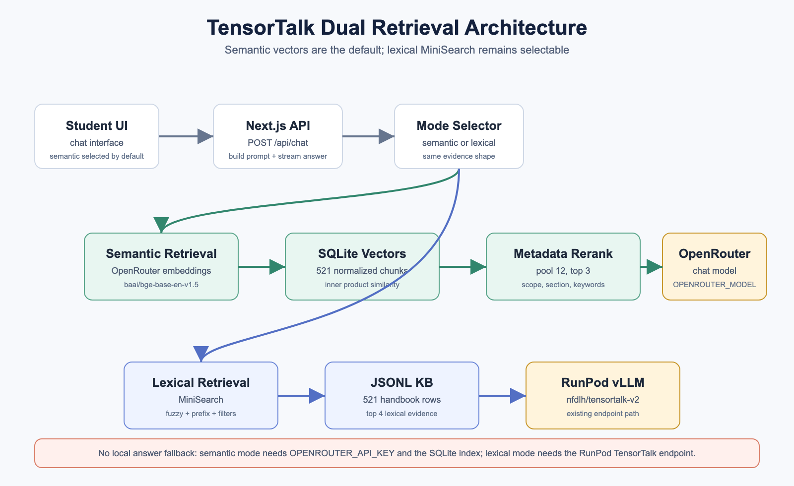
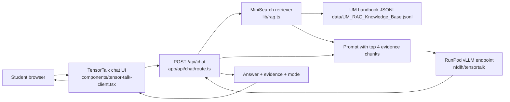

# TensorTalk Student Handbook

Next.js 16 web app for the UM FSKTM handbook assistant.



Model repo: [nfdlh/tensortalk](https://huggingface.co/nfdlh/tensortalk)

## How it works

TensorTalk is a retrieval-first handbook assistant. The browser never calls the
model directly. It sends each question to the Next.js API route, which selects
handbook evidence, adds that evidence to the prompt, and calls the hosted
fine-tuned model.



The request flow is:

1. Search `data/UM_RAG_Knowledge_Base.jsonl` locally with MiniSearch.
2. Keep the top 4 relevant handbook chunks as evidence.
3. Add the retrieved handbook evidence to the prompt.
4. Call the fine-tuned `nfdlh/tensortalk` model on RunPod through
   `@ai-sdk/openai-compatible`.
5. Return `{ answer, evidence, mode }` to the UI. The latest answer appears in
   the conversation, and its evidence appears in the right panel.

There is no OpenRouter path and no local answer fallback. If the RunPod endpoint
is unavailable, `/api/chat` returns an error instead of generating a fallback
answer.

For the retrieval details, see `docs/rag.md`.

## Run locally

```bash
pnpm install
pnpm dev
```

Open `http://localhost:3000`.

## Connect TensorTalk model

Copy the example environment file:

```bash
cp .env.example .env.local
```

Then fill `TENSORTALK_API_KEY` in `.env.local`. The file is gitignored.

## Infrastructure docs

See `docs/` for the model hosting and deployment notes:

- `docs/architecture.md`
- `docs/rag.md`
- `docs/model-infrastructure.md`
- `docs/huggingface-model.md`
- `docs/runpod-endpoint.md`
- `docs/vercel-deployment.md`
- `docs/model-update-checklist.md`
