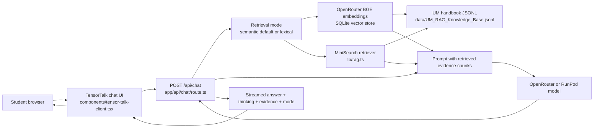

# TensorTalk Student Handbook

Next.js 16 web app for the UM FSKTM handbook assistant.


Model repo: [nfdlh/tensortalk-v2](https://huggingface.co/nfdlh/tensortalk-v2)

## How it works

TensorTalk is a retrieval-first handbook assistant. The browser never calls the
model directly. It sends each question to the Next.js API route, which selects
handbook evidence, adds that evidence to the prompt, and calls the hosted
fine-tuned model.



The request flow is:

1. Use the selected retrieval mode. Semantic vectors are the default; lexical
   MiniSearch remains available in the chat UI.
2. Keep the top semantic 3 or lexical 4 relevant handbook chunks as evidence.
3. Add the retrieved handbook evidence to the prompt.
4. In semantic mode, call OpenRouter chat. In lexical mode, call the fine-tuned
   `nfdlh/tensortalk-v2` model on RunPod through `@ai-sdk/openai-compatible`.
5. Stream model text back to the UI, returning `{ answer, evidence, mode }` and
   optional `thinking` when the model emits a `<think>` block. The latest answer
   appears in the conversation, and its evidence appears in the right panel.

Semantic mode uses OpenRouter `baai/bge-base-en-v1.5` embeddings and the
SQLite vector index at `data/UM_RAG_Vectors.sqlite`. Lexical mode keeps the
existing MiniSearch implementation.

For the retrieval details, see `docs/rag.md`.

## Fine-tuned model

The current deployed model is TensorTalk v2, a Stage 3 PPO fine-tune of Qwen3-8B
for UM FSKTM handbook question answering.

- Base model: Qwen3-8B
- Fine-tuning stage: Stage 3 PPO
- Reward type: balanced rule-based preference reward function
- Training rows: 900
- Validation rows: 100
- PPO epochs: 2
- Training log records: 900
- Served model name: `nfdlh/tensortalk-v2`

The Hugging Face repo contains the merged/full inference model for vLLM:
`model.safetensors`, tokenizer/config files, and small PPO proof artifacts. The
RunPod template should serve the same model name that Vercel sends in
`TENSORTALK_MODEL`.

## Run locally

```bash
pnpm install
```

Copy the example environment file:

```bash
cp .env.example .env.local
```

Then fill `TENSORTALK_API_KEY` in `.env.local`. The file is gitignored.

For semantic mode, also fill:

```text
OPENROUTER_API_KEY=
OPENROUTER_MODEL=google/gemini-3.1-flash-lite
OPENROUTER_EMBEDDING_MODEL=baai/bge-base-en-v1.5
```

Run `pnpm rag:index` after setting `OPENROUTER_API_KEY` to build the SQLite
vector store.

Start the app:

```bash
pnpm dev
```

Open `http://localhost:3000`.

## Infrastructure docs

See `docs/` for the model hosting and deployment notes:

- `docs/architecture.md`
- `docs/rag.md`
- `docs/model-infrastructure.md`
- `docs/huggingface-model.md`
- `docs/runpod-endpoint.md`
- `docs/vercel-deployment.md`
- `docs/model-update-checklist.md`
