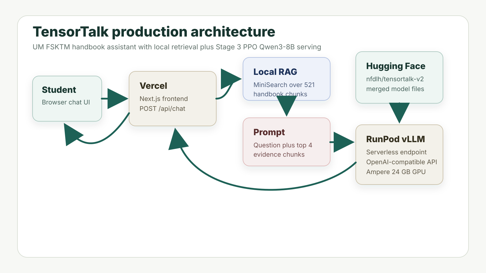
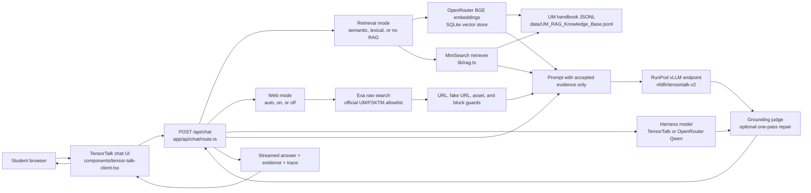

# TensorTalk Student Handbook

Next.js 16 web app for the UM FSKTM handbook assistant.



Model repo: [nfdlh/tensortalk-v2](https://huggingface.co/nfdlh/tensortalk-v2)

## How it works

TensorTalk is a retrieval and official-web grounded handbook assistant. The
browser never calls the model directly. It sends each question to the Next.js
API route, which routes local RAG and official UM/FSKTM web search, filters
evidence, adds accepted evidence to the prompt, and calls the hosted
fine-tuned TensorTalk model.



The request flow is:

1. Use the selected retrieval mode: Semantic, Lexical, or No RAG. Semantic
   vectors remain the default.
2. Use the selected web mode: Web Auto, Web On, or Web Off. Web Auto runs the
   route planner; Web On runs Exa and local RAG in parallel when RAG is enabled.
3. Use the selected harness model for route planning and one-pass repair.
   TensorTalk is the default and calls the RunPod fine-tuned model; OpenRouter
   Qwen uses `OPENROUTER_HARNESS_MODEL`.
4. Keep accepted local handbook evidence and up to 3 accepted official web
   evidence items. Rejected web URLs stay in Trace only.
5. Add accepted evidence to the prompt. No RAG + Web Off produces a model-only
   answer labeled as ungrounded.
6. Call the fine-tuned `nfdlh/tensortalk-v2` model endpoint through
   `@ai-sdk/openai-compatible`.
7. Run the deterministic grounding judge when evidence exists, then perform one
   repair pass if exact facts are unsupported.
8. Stream model text and stage events back to the UI, returning answer,
   evidence, trace, grounding, mode, and bounded optional `thinking` when the
   model emits a `<think>` block.
9. Add bounded thread history for follow-up questions. TensorTalk treats the
   live RunPod context window as 4096 tokens, reserves output space, includes
   newer turns first, and reports included/omitted history plus estimated usage.

Semantic mode uses OpenRouter `baai/bge-base-en-v1.5` embeddings and the
SQLite vector index at `data/UM_RAG_Vectors.sqlite`. Lexical mode keeps the
existing MiniSearch implementation. Official web search uses Exa raw retrieval
with an allowlist for UM and FSKTM domains. All modes use the fine-tuned
TensorTalk model for answer generation. The harness switch only changes route
planning and repair; it does not replace final-answer generation.

Thread history is stored locally in browser IndexedDB. The app does not store
API keys or large Exa page text in the browser.

For the retrieval details, see `docs/rag.md`.
For the Qwen/OpenRouter harness behavior, see `docs/qwen-harness.md`.
For the TensorCat source/data pipeline comparison, see
`docs/tensorcat-source-alignment.md`.

## Fine-tuned model

The served model is TensorTalk v2, a Stage 3 PPO fine-tune of Qwen3-8B for UM
FSKTM handbook question answering.

- Base model: Qwen3-8B
- Fine-tuning stage: Stage 3 PPO
- Reward type: balanced rule-based preference reward function
- Training rows: 900
- Validation rows: 100
- PPO epochs: 2
- Training log records: 900
- Served model name: `nfdlh/tensortalk-v2`

The Hugging Face repo contains the merged/full inference model for vLLM:
`model.safetensors`, tokenizer/config files, and small PPO proof artifacts. The
hosted endpoint should serve the same model name that Vercel sends in
`TENSORTALK_MODEL`.

## Run locally

```bash
pnpm install
```

Copy the example environment file:

```bash
cp .env.example .env.local
```

Then fill `TENSORTALK_API_KEY` in `.env.local`. The file is gitignored.
`TENSORTALK_MAX_OUTPUT_TOKENS` controls final generation length.
`TENSORTALK_MAX_THINKING_TOKENS` caps visible/runaway `<think>` output before
TensorTalk requests a concise final answer.

For semantic mode, also fill:

```text
OPENROUTER_API_KEY=
OPENROUTER_EMBEDDING_MODEL=baai/bge-base-en-v1.5
OPENROUTER_HARNESS_MODEL=qwen/qwen3-8b
```

Run `pnpm rag:index` after setting `OPENROUTER_API_KEY` to build the SQLite
vector store.

`OPENROUTER_HARNESS_MODEL` is used only when the UI harness selector is set to
OpenRouter Qwen. It does not replace the final TensorTalk answer model.

For official web search and automatic thread titles, fill:

```text
EXA_API_KEY=
THREAD_TITLE_MODEL=google/gemini-3.1-flash-lite
```

`EXA_API_KEY` is required only when Web On is selected or Web Auto decides a web
search is needed. Thread title generation uses OpenRouter and falls back to a
trimmed question if it is unavailable.

Start the app:

```bash
pnpm dev
```

Open `http://localhost:3000`.

Useful checks:

```bash
pnpm lint
pnpm test
pnpm build
```

## Infrastructure docs

See `docs/` for the model hosting and deployment notes:

- `docs/architecture.md`
- `docs/rag.md`
- `docs/qwen-harness.md`
- `docs/model-infrastructure.md`
- `docs/huggingface-model.md`
- `docs/runpod-endpoint.md`
- `docs/vercel-deployment.md`
- `docs/model-update-checklist.md`
- `docs/tensorcat-source-alignment.md`
