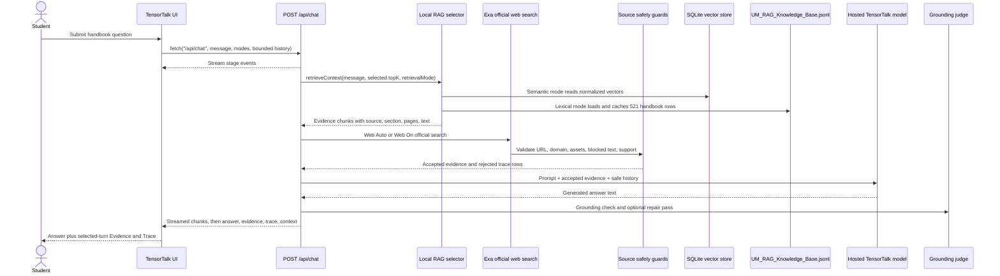

# TensorTalk architecture

This document records the app behavior in this repo.

## Runtime flow



## Source map

- `components/tensor-talk-client.tsx` owns the chat screen, mode controls,
  IndexedDB thread sidebar, selected-turn Evidence and Trace panels, retry, and
  context usage indicator.
- `lib/chat-client.ts` sends browser requests to `/api/chat` with `fetch`,
  reads NDJSON stage/metadata/text/done/error events, and turns API errors into
  user-visible messages.
- `app/api/chat/route.ts` validates the message and selected retrieval/web
  modes plus the selected harness and thinking modes, retrieves local evidence,
  optionally plans and searches official web evidence, builds a bounded prompt,
  streams the hosted TensorTalk model,
  separates `<think>` blocks into optional `thinking`, runs grounding and one
  repair pass, and returns answer, evidence, trace, grounding, route, and
  context metadata.
- `lib/rag.ts` supports two retrieval modes. Semantic mode embeds the query with
  OpenRouter `baai/bge-base-en-v1.5`, searches `data/UM_RAG_Vectors.sqlite`,
  and applies metadata-aware reranking. Lexical mode keeps the cached MiniSearch
  index over `data/UM_RAG_Knowledge_Base.jsonl`. No RAG skips local retrieval.
- `lib/web-agent.ts` calls Exa raw search only, using UM/FSKTM includeDomains
  plus URL allowlist, fake URL, asset URL, blocked/empty content, and support
  scoring guards.
- `lib/grounding.ts` checks exact fact support and decides whether the one-pass
  repair should replace the draft answer.
- `lib/context-budget.ts` keeps prompts under the live RunPod 4096-token
  context window by reserving output space and prioritizing newer thread turns.
- `lib/thread-store.ts` stores browser-local thread metadata in IndexedDB while
  compacting evidence text and never storing secrets.
- `scripts/build-rag-index.ts` builds `data/UM_RAG_Vectors.sqlite` from the
  handbook JSONL using OpenRouter embeddings.
- `data/UM_RAG_Knowledge_Base.jsonl` is the local handbook knowledge base. This
  checkout contains 521 JSONL rows.

For the retrieval scoring details, see `docs/rag.md`.

## Retrieval behavior

Semantic retrieval is the default mode in the chat UI. It uses normalized
OpenRouter `baai/bge-base-en-v1.5` embeddings, inner-product similarity from
the SQLite vector store, then metadata-aware reranking. Lexical retrieval is
still selectable and indexes `title`, `retrieval_text`, `source_text`,
`section`, `subsection`, and `scope_label` with MiniSearch. No RAG disables
local retrieval so the answer is model-only unless Web Auto or Web On supplies
accepted official web evidence.

Before searching, the query is normalized into meaningful terms. Common stop
words are removed, and `ai` expands to `artificial intelligence`. MiniSearch
uses fuzzy and prefix matching, then `lib/rag.ts` applies an additional relevance
filter so unrelated prompts do not receive arbitrary handbook rows.

The API asks for 3 semantic evidence chunks or 4 lexical evidence chunks:

```ts
retrieveContext(message, retrievalMode === "semantic" ? 3 : 4, retrievalMode)
```

Those chunks are eligible for the prompt only after route-specific checks. Web
evidence is accepted only from allowlisted official UM/FSKTM URLs. Rejected
web URLs are reported in Trace and are never inserted into the model prompt.

The API also adds as much prior thread history as safely fits. History is only
for follow-up references, not authority for official facts. The response
includes `maxContextTokens`, `reservedOutputTokens`, `estimatedInputTokens`,
`estimatedContextUsagePercent`, `includedHistoryCount`, `omittedHistoryCount`,
and `contextTruncated`.

## Model path

The request paths are:

```text
Semantic mode -> OpenRouter embeddings -> SQLite vectors -> hosted TensorTalk endpoint -> nfdlh/tensortalk-v2
Lexical mode -> MiniSearch -> hosted TensorTalk endpoint -> nfdlh/tensortalk-v2
No RAG + Web Off -> hosted TensorTalk endpoint -> model-only answer
Web Auto/On -> Exa raw search -> source guards -> hosted TensorTalk endpoint
```

The API reads these variables:

```text
TENSORTALK_MODEL
TENSORTALK_API_BASE_URL
TENSORTALK_API_KEY
OPENROUTER_API_KEY
OPENROUTER_BASE_URL
OPENROUTER_EMBEDDING_MODEL
OPENROUTER_HARNESS_MODEL
EXA_API_KEY
THREAD_TITLE_MODEL
TENSORTALK_MAX_OUTPUT_TOKENS
TENSORTALK_MAX_THINKING_TOKENS
```

`TENSORTALK_MODEL` defaults to `nfdlh/tensortalk-v2`. `TENSORTALK_API_KEY` may
also come from `HUGGINGFACE_API_KEY` or `HF_TOKEN`. For the configured RunPod
setup, use the RunPod API key.

`OPENROUTER_EMBEDDING_MODEL` defaults to `baai/bge-base-en-v1.5`.
`OPENROUTER_HARNESS_MODEL` defaults to `qwen/qwen3-8b` and is used only when
the UI harness selector is set to OpenRouter Qwen. Final answer generation
still uses the hosted TensorTalk endpoint.
See `docs/qwen-harness.md` for the harness contract.
`EXA_API_KEY` is required only when Web On is selected or Web Auto decides that
official web evidence is required. `THREAD_TITLE_MODEL` defaults to a cheap
OpenRouter title model and falls back to a trimmed question when unavailable.

The final TensorTalk answer call uses:

```text
maxOutputTokens: TENSORTALK_MAX_OUTPUT_TOKENS, default 640
temperature: 0.2
timeout: 60000 ms
maxRetries: 1
```

The Route combobox also exposes a thinking mode. `Off` asks for a direct answer
and uses a very small `<think>` cutoff, `Limited` uses
`TENSORTALK_MAX_THINKING_TOKENS`, and `More` raises the per-request thinking
budget and output budget without changing the final answer model.

The response `mode` is one of:

```text
tensortalk-endpoint:<model-name>
```

## Failure behavior

If semantic mode is selected and the SQLite vector index is missing,
`/api/chat` returns a setup error asking for `pnpm rag:index`. If
`TENSORTALK_API_BASE_URL` is missing, either retrieval mode returns an endpoint
setup message. If a hosted model call fails before streaming starts,
`/api/chat` returns a 502 response.
If a model call starts and then fails mid-stream, the API sends an NDJSON
`error` event because the HTTP status has already been committed.
If Web On or Web Auto requires official web search and `EXA_API_KEY` is
missing, the API returns a web setup error. If web search runs but no accepted
official evidence survives the guards, the API explains that no accepted
UM/FSKTM evidence was found instead of answering from rejected URLs.
