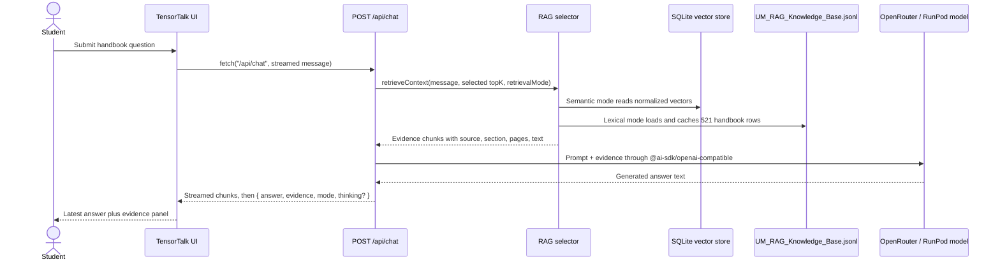

# TensorTalk architecture

This document records the current app behavior from the source code.

## Runtime flow



## Source map

- `components/tensor-talk-client.tsx` owns the chat screen, quick prompts,
  mutation state, error text, and latest-answer evidence panel.
- `lib/chat-client.ts` sends browser requests to `/api/chat` with `fetch`,
  reads the NDJSON stream, and turns API errors into user-visible messages.
- `app/api/chat/route.ts` validates the message and selected retrieval mode,
  retrieves evidence, builds the prompt, streams the selected hosted model,
  separates `<think>` blocks into optional `thinking`, and returns
  `{ answer, evidence, mode, retrievalMode, thinking? }`.
- `lib/rag.ts` supports two retrieval modes. Semantic mode embeds the query with
  OpenRouter `baai/bge-base-en-v1.5`, searches `data/UM_RAG_Vectors.sqlite`,
  and applies metadata-aware reranking. Lexical mode keeps the cached MiniSearch
  index over `data/UM_RAG_Knowledge_Base.jsonl`.
- `scripts/build-rag-index.ts` builds `data/UM_RAG_Vectors.sqlite` from the
  handbook JSONL using OpenRouter embeddings.
- `data/UM_RAG_Knowledge_Base.jsonl` is the local handbook knowledge base. It
  currently contains 521 JSONL rows.

For the retrieval scoring details, see `docs/rag.md`.

## Retrieval behavior

Semantic retrieval is the default mode in the chat UI. It uses normalized
OpenRouter `baai/bge-base-en-v1.5` embeddings, inner-product similarity from
the SQLite vector store, then metadata-aware reranking. Lexical retrieval is
still selectable and indexes `title`, `retrieval_text`, `source_text`,
`section`, `subsection`, and `scope_label` with MiniSearch.

Before searching, the query is normalized into meaningful terms. Common stop
words are removed, and `ai` expands to `artificial intelligence`. MiniSearch
uses fuzzy and prefix matching, then `lib/rag.ts` applies an additional relevance
filter so unrelated prompts do not receive arbitrary handbook rows.

The API asks for 3 semantic evidence chunks or 4 lexical evidence chunks:

```ts
retrieveContext(message, retrievalMode === "semantic" ? 3 : 4, retrievalMode)
```

Those chunks are inserted into the model prompt with source document, scope,
section, subsection, pages, and source text.

## Model path

The current model paths are:

```text
Semantic mode -> OpenRouter embeddings -> SQLite vectors -> OpenRouter chat
Lexical mode -> MiniSearch -> RunPod Serverless -> vLLM -> nfdlh/tensortalk-v2
```

The API reads these variables:

```text
TENSORTALK_MODEL
TENSORTALK_API_BASE_URL
TENSORTALK_API_KEY
OPENROUTER_API_KEY
OPENROUTER_MODEL
OPENROUTER_EMBEDDING_MODEL
```

`TENSORTALK_MODEL` defaults to `nfdlh/tensortalk-v2`. `TENSORTALK_API_KEY` may also
come from `HUGGINGFACE_API_KEY` or `HF_TOKEN`, but the intended production key is
the RunPod API key.

`OPENROUTER_MODEL` defaults to `google/gemini-3.1-flash-lite`.
`OPENROUTER_EMBEDDING_MODEL` defaults to `baai/bge-base-en-v1.5`.

The model call uses:

```text
maxOutputTokens: 512
temperature: 0.2
timeout: 60000 ms
maxRetries: 1
```

The response `mode` is one of:

```text
openrouter:<model-name>
tensortalk-endpoint:<model-name>
```

## Failure behavior

There is no local answer fallback. If semantic mode is selected and the SQLite
vector index is missing, `/api/chat` returns a setup error asking for
`pnpm rag:index`. If lexical mode is selected and `TENSORTALK_API_BASE_URL` is
missing, `/api/chat` returns a RunPod setup message. If a hosted model call
fails before streaming starts, `/api/chat` returns a 502 response.
If a model call starts and then fails mid-stream, the API sends an NDJSON
`error` event because the HTTP status has already been committed.
