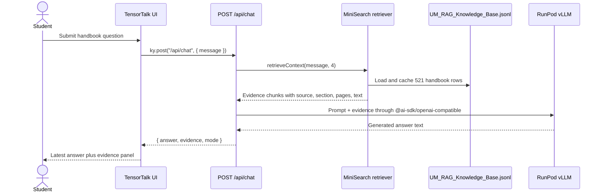

# TensorTalk architecture

This document records the current app behavior from the source code.

## Runtime flow



## Source map

- `components/tensor-talk-client.tsx` owns the chat screen, quick prompts,
  mutation state, error text, and latest-answer evidence panel.
- `lib/chat-client.ts` sends browser requests to `/api/chat` with `ky` and turns
  API errors into user-visible messages.
- `app/api/chat/route.ts` validates the message, retrieves evidence, builds the
  prompt, calls the hosted model, strips `<think>` blocks, and returns
  `{ answer, evidence, mode }`.
- `lib/rag.ts` loads `data/UM_RAG_Knowledge_Base.jsonl`, builds a cached
  MiniSearch index, filters weak matches, and returns the top evidence chunks.
- `data/UM_RAG_Knowledge_Base.jsonl` is the local handbook knowledge base. It
  currently contains 521 JSONL rows.

## Retrieval behavior

The retriever indexes `title`, `retrieval_text`, `source_text`, `section`,
`subsection`, and `scope_label`. It stores the fields needed for display:
`kb_id`, `source_doc`, `scope_label`, `section`, `subsection`, `pages`,
`source_text`, and `grounded_answer_bank`.

Before searching, the query is normalized into meaningful terms. Common stop
words are removed, and `ai` expands to `artificial intelligence`. MiniSearch
uses fuzzy and prefix matching, then `lib/rag.ts` applies an additional relevance
filter so unrelated prompts do not receive arbitrary handbook rows.

The API asks for 4 evidence chunks:

```ts
retrieveContext(message, 4)
```

Those chunks are inserted into the model prompt with source document, scope,
section, subsection, pages, and source text.

## Model path

The current model path is:

```text
Next.js API -> RunPod Serverless -> vLLM OpenAI-compatible endpoint -> nfdlh/tensortalk
```

The API reads these variables:

```text
TENSORTALK_MODEL
TENSORTALK_API_BASE_URL
TENSORTALK_API_KEY
```

`TENSORTALK_MODEL` defaults to `nfdlh/tensortalk`. `TENSORTALK_API_KEY` may also
come from `HUGGINGFACE_API_KEY` or `HF_TOKEN`, but the intended production key is
the RunPod API key.

The model call uses:

```text
maxOutputTokens: 512
temperature: 0.2
timeout: 60000 ms
maxRetries: 1
```

The response `mode` is:

```text
tensortalk-endpoint:<model-name>
```

## Failure behavior

There is no local answer fallback and no OpenRouter route. If
`TENSORTALK_API_BASE_URL` is missing, `/api/chat` returns a 502 response with a
public setup message. If the RunPod endpoint or model call fails, `/api/chat`
returns:

```text
The fine-tuned TensorTalk model could not be reached.
```

This is intentional because the current app should use the hosted fine-tuned
TensorTalk model instead of generating local evidence-only answers.
