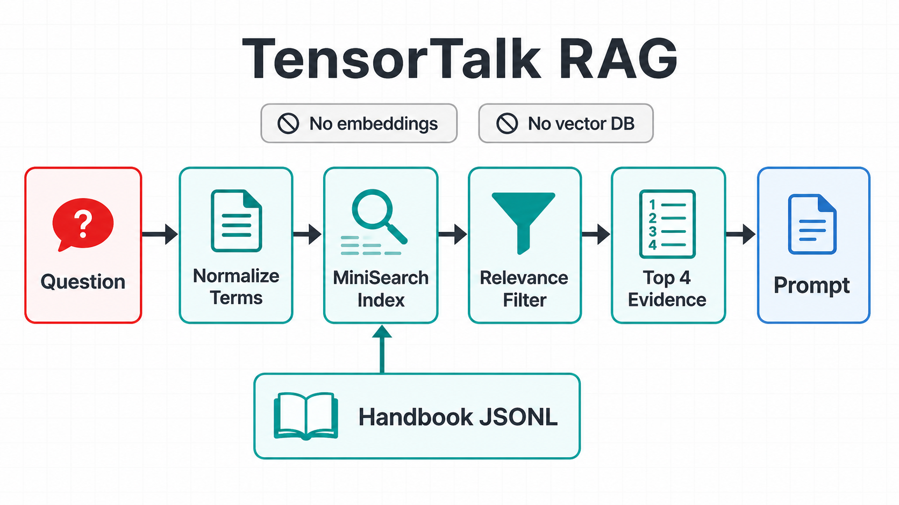
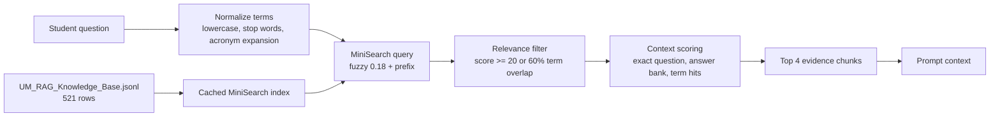
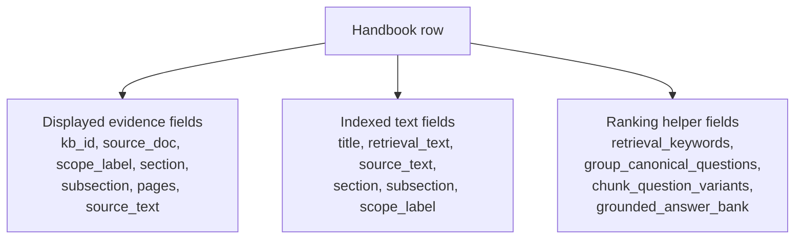
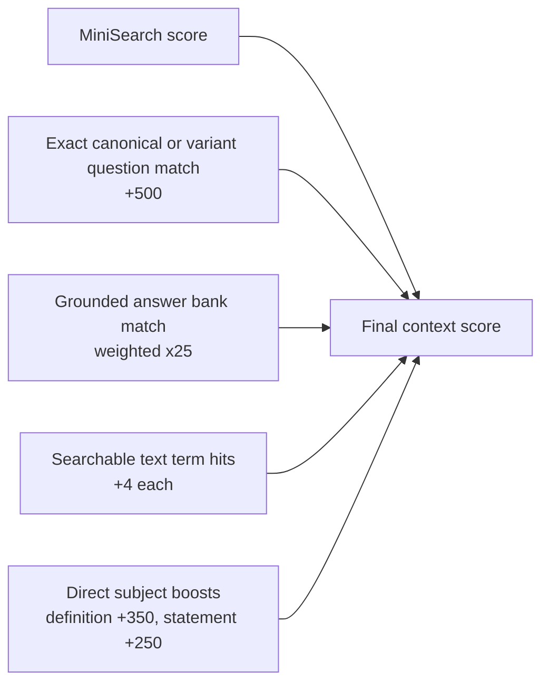

# TensorTalk RAG

TensorTalk uses local lexical retrieval before it calls the hosted model. The
retriever is in `lib/rag.ts`, and the data source is
`data/UM_RAG_Knowledge_Base.jsonl`.



There is no embedding model, vector database, SQLite search layer, or remote
retrieval service in the current app. The API route reads the handbook JSONL
from disk, builds a cached MiniSearch index, and selects evidence for the prompt.

## Retrieval flow



`app/api/chat/route.ts` calls:

```ts
retrieveContext(message, 4)
```

The returned evidence is inserted into the model prompt with source document,
scope, section, subsection, pages, and source text. The same evidence array is
returned to the UI so the right panel can show the sections behind the latest
answer.

## Knowledge base rows

Each JSONL row represents a handbook chunk plus retrieval metadata. The app does
not need all fields at display time, but the extra question and answer fields
help retrieval rank the right chunk.



MiniSearch indexes these fields:

- `title`
- `retrieval_text`
- `source_text`
- `section`
- `subsection`
- `scope_label`

MiniSearch stores these fields for the returned evidence:

- `kb_id`
- `source_doc`
- `scope_label`
- `section`
- `subsection`
- `pages`
- `source_text`
- `grounded_answer_bank`

## Query normalization

The question is trimmed and converted into meaningful terms:

1. Lowercase the question.
2. Extract alphanumeric terms.
3. Remove short terms and common stop words such as `what`, `where`, `the`, and
   `to`.
4. Expand known acronyms. Currently `ai` expands to `artificial intelligence`.
5. Join the remaining terms into the MiniSearch query.

If no meaningful terms remain, the original question is used.

## Search and filtering

MiniSearch is configured with:

```text
title boost: 2
section boost: 2
subsection boost: 2
retrieval_text boost: 1.5
fuzzy: 0.18
prefix: true
```

After MiniSearch returns matches, `lib/rag.ts` applies a second relevance check.
A row is kept if either condition is true:

```text
MiniSearch score >= 20
or
matched query terms >= ceil(query term count * 0.6)
```

This avoids attaching arbitrary handbook chunks to off-domain or weakly matched
questions.

## Context scoring

Kept rows are rescored before the top 4 are selected:



The subject boosts apply only for direct `what is ...` or `who is ...` style
questions. This helps definition and role questions land on the most direct
handbook chunk.

## Prompt handoff

The API route builds a prompt from the selected evidence:

```text
Evidence 1
Source: ...
Scope: ...
Section: ...
Subsection: ...
Pages: ...
Text: ...
```

If no matching evidence is retrieved, the prompt says:

```text
No matching handbook evidence was retrieved for this question.
```

The hosted TensorTalk model still answers, but the prompt tells it not to invent
exact handbook rules, numbers, or page references when the evidence is not
enough.
