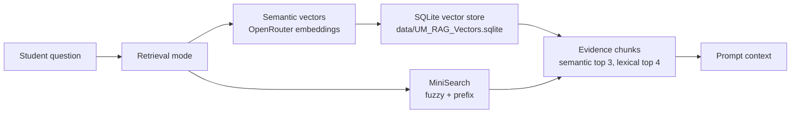

# TensorTalk RAG

TensorTalk has two retrieval implementations. The chat UI defaults to semantic
vectors, and MiniSearch is still available as the fast lexical path.

The shared data source is `data/UM_RAG_Knowledge_Base.jsonl`.

## Modes



## Semantic vector mode

Semantic mode mirrors the TensorTalk notebook retrieval design in a Next.js
runtime-friendly way:

```text
Embedding model: baai/bge-base-en-v1.5
Embedding provider: OpenRouter embeddings API
Vector store: SQLite
Similarity: inner product after embedding normalization
Top-k retrieval: 3
Rerank pool: 12
Rerank: dense score + metadata bonuses
```

Build the SQLite vector store after setting `OPENROUTER_API_KEY`:

```bash
pnpm rag:index
```

The build script reads `data/UM_RAG_Knowledge_Base.jsonl`, embeds each
`retrieval_text` bundle with OpenRouter, normalizes the vectors, and writes
`data/UM_RAG_Vectors.sqlite`.

At request time, `lib/rag.ts` embeds the student question through OpenRouter,
loads vectors from SQLite, ranks by normalized inner product, then applies the
metadata-aware rerank weights:

```text
dense score: 0.82
scope bonus: 0.06
section bonus: 0.04
subsection bonus: 0.03
source document bonus: 0.02
keyword bonus: 0.03
scope mismatch prior: x0.92
```

## Lexical mode

Lexical mode reads the handbook JSONL from disk, builds a cached MiniSearch
index, and selects evidence for the prompt.

MiniSearch indexes these fields:

- `title`
- `retrieval_text`
- `source_text`
- `section`
- `subsection`
- `scope_label`

MiniSearch stores these fields for the returned evidence:

- `kb_id`
- `source_doc`
- `scope_label`
- `section`
- `subsection`
- `pages`
- `source_text`
- `grounded_answer_bank`

Before searching, the query is normalized into meaningful terms:

1. Lowercase the question.
2. Extract alphanumeric terms.
3. Remove short terms and common stop words such as `what`, `where`, `the`, and
   `to`.
4. Expand known acronyms. Currently `ai` expands to `artificial intelligence`.
5. Join the remaining terms into the MiniSearch query.

MiniSearch is configured with:

```text
title boost: 2
section boost: 2
subsection boost: 2
retrieval_text boost: 1.5
fuzzy: 0.18
prefix: true
```

After MiniSearch returns matches, `lib/rag.ts` keeps rows where:

```text
MiniSearch score >= 20
or
matched query terms >= ceil(query term count * 0.6)
```

Kept rows are rescored with exact question matches, grounded answer-bank hits,
term hits, and direct-subject boosts before the top 4 lexical results are
returned.

## Prompt handoff

Both modes return the same evidence shape. The API route inserts the selected
evidence into the hosted model prompt with source document, scope, section,
subsection, pages, and source text. The same evidence array is returned to the
UI so the right panel can show the sections behind the latest answer.
