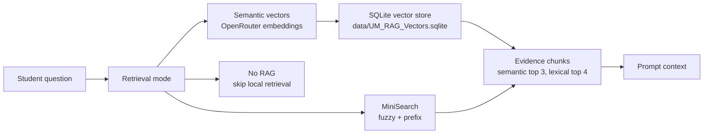

# TensorTalk RAG

TensorTalk has two local retrieval implementations plus a No RAG route. The
chat UI defaults to semantic vectors, MiniSearch is still available as the fast
lexical path, and No RAG disables local handbook evidence.

The shared data source is `data/UM_RAG_Knowledge_Base.jsonl`.

## Modes



## Semantic vector mode

Semantic mode mirrors the TensorTalk notebook retrieval design in a Next.js
runtime-friendly way:

```text
Embedding model: baai/bge-base-en-v1.5
Embedding provider: OpenRouter embeddings API
Vector store: SQLite
Similarity: inner product after embedding normalization
Top-k retrieval: 3
Rerank pool: 12
Index batch size: 96
Embedding text cap: none by default
Rerank: dense score + metadata bonuses
```

Build the SQLite vector store after setting `OPENROUTER_API_KEY`:

```bash
pnpm rag:index
```

The build script reads `data/UM_RAG_Knowledge_Base.jsonl`, embeds each
`retrieval_text` bundle with OpenRouter, normalizes the vectors, and writes
`data/UM_RAG_Vectors.sqlite`.

`RAG_INDEX_BATCH_SIZE` defaults to `96` to match the TensorCat notebook. The
indexer does not truncate `retrieval_text` before embedding unless
`RAG_INDEX_MAX_TEXT_CHARS` is set. If a provider returns an invalid batch, the
script still splits the batch, and a failing single long row can be retried with
a shorter text slice as a provider fallback.

At request time, `lib/rag.ts` embeds the student question through OpenRouter,
loads vectors from SQLite, ranks by normalized inner product, then applies the
metadata-aware rerank weights:

```text
dense score: 0.82
scope bonus: 0.06
section bonus: 0.04
subsection bonus: 0.03
source document bonus: 0.02
keyword bonus: 0.03
scope mismatch prior: x0.92
```

## Lexical mode

Lexical mode reads the handbook JSONL from disk, builds a cached MiniSearch
index, and selects evidence for the prompt.

MiniSearch indexes these fields:

- `title`
- `retrieval_text`
- `source_text`
- `section`
- `subsection`
- `scope_label`

MiniSearch stores these fields for the returned evidence:

- `kb_id`
- `source_doc`
- `scope_label`
- `section`
- `subsection`
- `pages`
- `source_text`
- `grounded_answer_bank`

Before searching, the query is normalized into meaningful terms:

1. Lowercase the question.
2. Extract alphanumeric terms.
3. Remove short terms and common stop words such as `what`, `where`, `the`, and
   `to`.
4. Expand known acronyms. Currently `ai` expands to `artificial intelligence`.
5. Join the remaining terms into the MiniSearch query.

MiniSearch is configured with:

```text
title boost: 2
section boost: 2
subsection boost: 2
retrieval_text boost: 1.5
fuzzy: 0.18
prefix: true
```

After MiniSearch returns matches, `lib/rag.ts` keeps rows where:

```text
MiniSearch score >= 20
or
matched query terms >= ceil(query term count * 0.6)
```

Kept rows are rescored with exact question matches, grounded answer-bank hits,
term hits, and direct-subject boosts before the top 4 lexical results are
returned.

## No RAG mode

No RAG returns no local handbook evidence. With Web Off, the model answers from
its own parameters and the prompt tells it to state when exact official evidence
is unavailable. With Web Auto or Web On, accepted official web evidence can
still be added to the prompt.

## Official web search

Official web search is separate from local RAG. Web Auto runs local RAG first
and then uses the hosted route planner plus deterministic guards to decide
whether Exa is needed. Web On runs Exa and local RAG in parallel when local RAG
is enabled. Web Off never calls Exa.

The Exa request uses raw retrieval only:

```text
type: auto
numResults: 8
includeDomains: official UM/FSKTM allowlist
contents: highlights + limited text
```

`lib/web-agent.ts` accepts only official UM/FSKTM pages and PDFs, rejects fake
or malformed URLs, asset URLs, blocked/empty pages, and low-support results,
then keeps at most 3 web evidence items. Rejected URLs are trace metadata only
and never enter the prompt.

## Grounding and context

When accepted evidence exists, `lib/grounding.ts` checks exact facts in the
draft answer against accepted evidence metadata and text. If unsupported exact
facts remain, the API runs one repair pass and keeps the repair only when it
improves support.

Thread history is bounded by `lib/context-budget.ts`. The live RunPod endpoint
is treated as an 8192-token context window, output tokens are reserved, evidence
and prompt overhead are counted, and newer turns are prioritized. The API
returns context metadata so the UI can show usage and truncation state.

## Prompt handoff

All evidence paths return the same `Evidence` shape. The API route inserts only
accepted evidence into the hosted model prompt with source document, scope,
section, subsection, pages, official URL metadata, support score, and source
text. The same accepted evidence array is returned to the UI so the selected
turn Evidence panel can show the support behind any previous answer.
